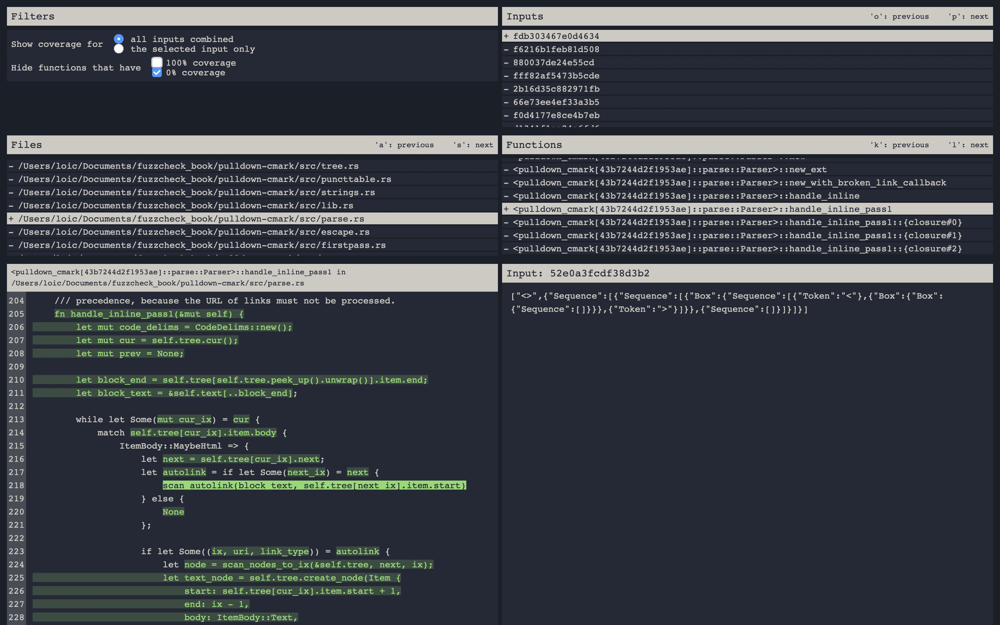

# fuzzcheck-view

fuzzcheck-view is a tool to visualise the code coverage of inputs generated by
[fuzzcheck](https://github.com/loiclec/fuzzcheck-rs). It is currently very 
basic and does not handle errors well, but it seems to work.

Please note that it is currently published under the Anti-Capitalist Software 
License. This means that you are free to use, copy, modify, and distribute or 
sell copies of it **if you are an individual, a non-profit organisation, an 
educational institution, or an organisation that seeks shared profit for all 
of its members, and allows non-members to set the cost of their labor**. If you 
do not meet any of these requirements but would still like to use 
`fuzzcheck-view`, please contact me at loic.lecrenier@me.com . I am also 
automatically granting the permission to use, copy, and modify the tool to all 
of my sponsors. 

To install it, run:

```
cargo install --git https://github.com/loiclec/fuzzcheck-view
```

After running the fuzz test `tests::fuzz` on the crate `my_crate` with 
fuzzcheck, you can launch `fuzzcheck-view` as follows:

```sh
fuzzcheck-view -d "my_crate" -t "tests::fuzz"
```

where the argument to `-d` (directory) is a path to the top folder of a Rust 
crate (containing a `Cargo.toml`). The argument to `-t` is the exact path to 
the test function run by `fuzzcheck`. Additionally, if you are using cargo
workspace, you need to give the path to the top folder of the workspace with
`-w`. For example, if you have a workspace called `compiler` that contains a
crate called `parser`. Then, assuming the current directory is the top-level
folder of the workspace, you should use something like:

```sh
fuzzcheck-view -w "." -d "my_crate" -t "parse_ident::tests::fuzz1"
```

`fuzzcheck-view` expects the following folder structure:

```sh
- my_crate # (path given to -d )
    - fuzz
        - tests::fuzz
            - stats
                - <timestamp>
                    - ...
                - <timestamp>
                    - uniq_cov,json
                    - coverage_sensor.json
                    - world.json
            - ...
        - tests::fuzz2
            - ...
```

This folder structure is generated by `fuzzcheck` when fuzzing a function using
the default options. 

If it launches properly, it serves a webpage on `localhost:8000` looking like
this:



On the top left is a list of options about what code coverage to visualise. 
You can choose to visualise the coverage of all test cases combined, or of a 
particular one. You can also choose to filter the list of functions shown to 
make it easier to navigate.

On the top right is the list of inputs saved by fuzzcheck’s `uniq_cov` pool. 
They are sorted by their “interestingness” score. You can hover the mouse over
an input to see a preview of it underneath, or select one to view its 
associated code coverage (if you have selected that option in the top left 
panel).

On the second row is a list of files and functions. Only the code coverage of 
the selected function will be shown. You can quickly switch between files 
using the `a` and `s` keys and switch between functions using the `k` and `l` 
keys.

Finally, on the bottom left, we have the code coverage. The parts highlighted 
in green were reached by the fuzzer/input. The parts highlighted in red were 
not. The parts that are not highlighted were not instrumented.

If you hover over a region of green highlighted code, the **smallest input 
that reaches this region of code** is shown on the right. 
